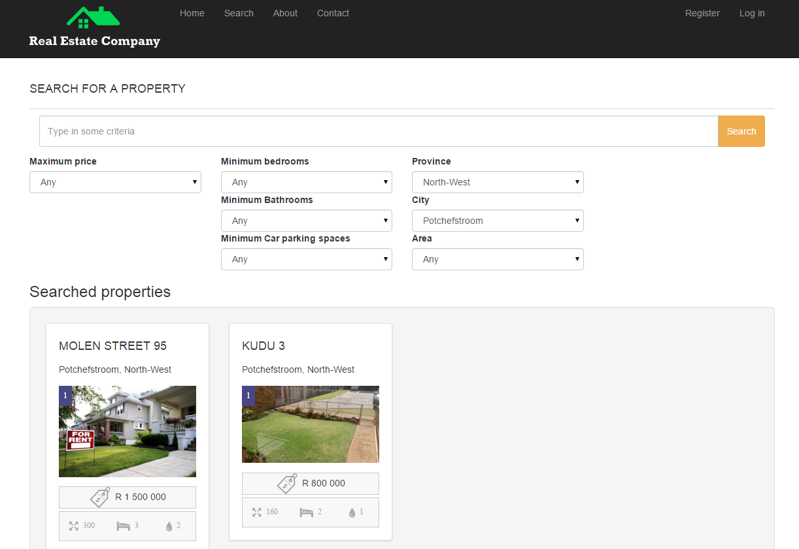
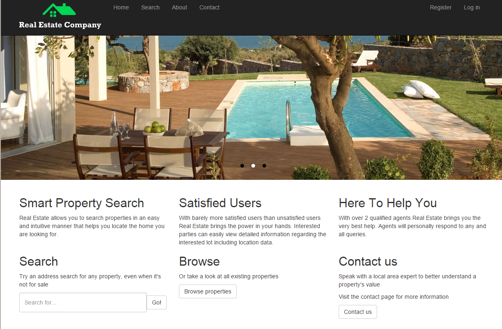

# Real Estate Web site

Written in ASP.NET MVC 4.
Utilizes:
* MySQL database
* Bootstrap 3
* JQuery
* React JS

## Features
* Browse properties
* View property listing
* Indicates property on map and provides google street view
* Search for properties
* Search criteria includes location (province, area, city) and features (number of bathrooms, number of bedrooms) and price
* Contact agent regarding property

## Screenshots

